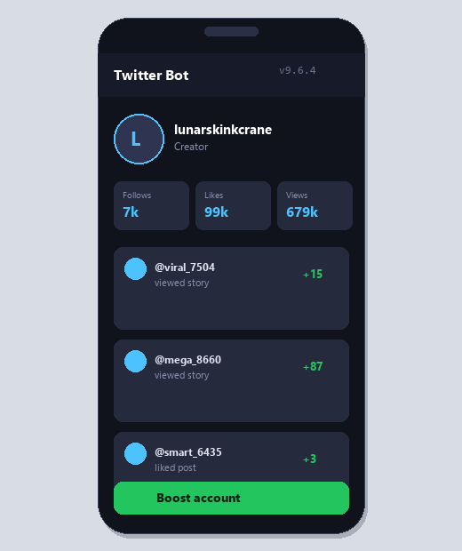

# Twitter Bot — Free 2026 Download

   

  

Twitter bot free download — current 2026 version, full requirements and a step-by-step install guide, all on one page. **Completely free. No limits.**

## 🎯 At a Glance

| | |
| --- | --- |
| **Program** | Twitter Bot |
| **Version** | Latest 2026 build |
| **Price** | Free |
| **Systems** | see requirements below |
| **Download** | Quick Start section below |

## ❓ What Is Twitter Bot?

twitter bot is a popular tool used by millions every month. The current version is faster and lighter than previous releases and works on all modern systems.

| **Term** | **Explanation** |
| --- | --- |
| **Full version** | All features included |
| **Portable** | Runs without installation |
| **2026 build** | The latest release |

## 💬 Why It's Free

Twitter Bot is distributed free of charge. There is no account, no subscription and no payment step — you download, run it and you are done. The project is maintained and rebuilt for each new 2026 release.

## ❌ The Problem

- **Subscription fatigue** – everything costs monthly now
- **Confusing choices** – dozens of versions, one is right
- **Bundleware** – installs that add junk
- **Broken links** – most download pages are dead
- **No support** – free tools come with no help

## ✅ The Solution

| **Problem** | **Solution** |
| --- | --- |
| **Paid versions** | ✅ Full version, free |
| **Trial limits** | ✅ No expiration |
| **Fake downloads** | ✅ Tested build on this page |
| **Heavy installs** | ✅ Clean setup |
| **Old versions** | ✅ Latest 2026 build |

## 📊 Why Twitter Bot

| **Feature** | **Alternatives** | **twitter bot** |
| --- | --- | --- |
| **Price** | Often paid | ✅ Free |
| **Updates** | Rare | ✅ Regular |
| **Setup** | Complicated | ✅ Two minutes |
| **Support** | None | ✅ FAQ + issues |
| **Size** | Large | ✅ Small |

## 🎯 Key Features

| **Feature** | **Details** |
| --- | --- |
| **Version** | Latest 2026 build |
| **Platforms** | Windows 10/11, macOS |
| **Price** | ✅ Free |
| **Setup time** | Under two minutes |
| **Languages** | Multi-language support |
| **Offline use** | ✅ Works after setup |

## 📋 System Requirements

| **Component** | **Minimum** | **Recommended** |
| --- | --- | --- |
| **OS** | Windows 10 | Windows 11 (64-bit) |
| **RAM** | 4 GB | 8 GB |
| **Disk** | 500 MB free | 2 GB free |
| **Network** | For download | For updates |

## 📦 What's Included

| **Component** | **Details** |
| --- | --- |
| **Software** | Full tested version |
| **Instructions** | Quick start guide |
| **Requirements** | Listed above |
| **Support** | Via issues |

## ⚡ Quick Start

1. **⬇️ Download** the file with the button below
2. **📂 Open** the installer
3. **⚙️ Choose** the default settings
4. **✅ Launch** from the desktop shortcut

> **💡 Tip:** close other programs during setup to avoid file conflicts.

<b>💡 Tips for Best Results</b>

- ✅ Run the installer as administrator
- ✅ Let the setup finish completely
- ✅ Pin the program for quick access
- ✅ Reinstall if something breaks — it takes two minutes

<b>⚠️ Known Issues & Fixes</b>

| **Issue** | **Fix** |
| --- | --- |
| **Wrong version** | Download the 2026 build |
| **Stuck setup** | Close other installers, retry |
| **No shortcut** | Reinstall with default settings |

  

## ❓ Frequently Asked Questions

**Is it free to use?**

Yes, completely.

**Is it a virus?**

No — tested and clean.

**What are the requirements?**

See the table above — most computers from the last 8 years are fine.

**How long does the install take?**

Under two minutes.

**Can I move it to another PC?**

Yes — download again and repeat the steps.

## 🏁 Final Summary

**twitter bot** is the complete free tool for 2026 — full version, light setup, regular updates.

**What you'll get:**

- ✅ Latest 2026 version
- ✅ All features included
- ✅ Simple two-minute setup
- ✅ Free — no payments, no registration

**Download twitter bot today!**

## 🗂 Version History

| **Build** | **Date** | **Notes** |
| --- | --- | --- |
| 2026.4 | 2026-10-08 | Latest stable, current release |
| 2026.3 | earlier | Performance improvements |
| 2026.2 | earlier | Bug fixes |
| 2026.1 | earlier | First public build |

---

*solar-walrus-510 · Updated 2026-10-08 · Shared under the MIT License*
